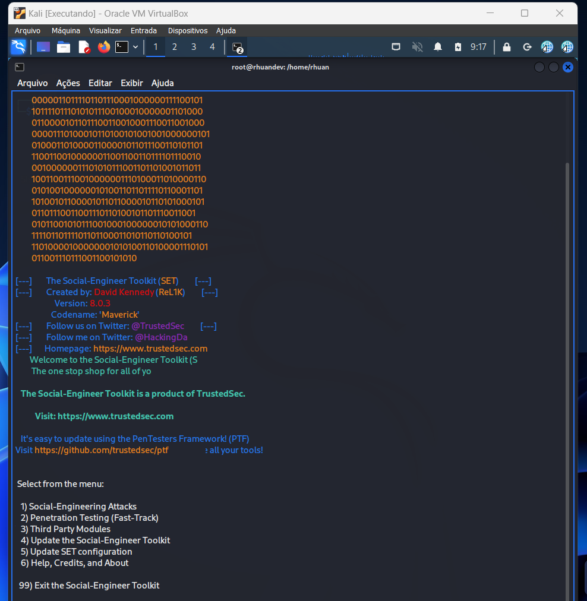
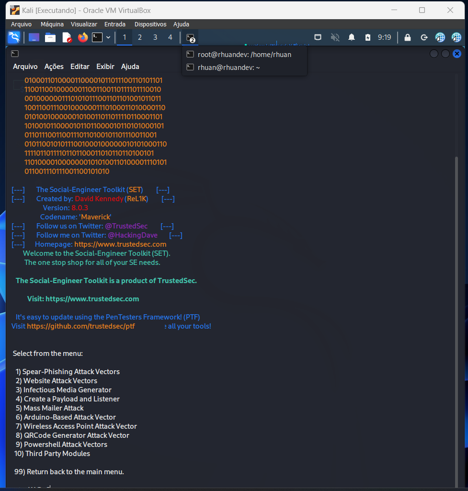
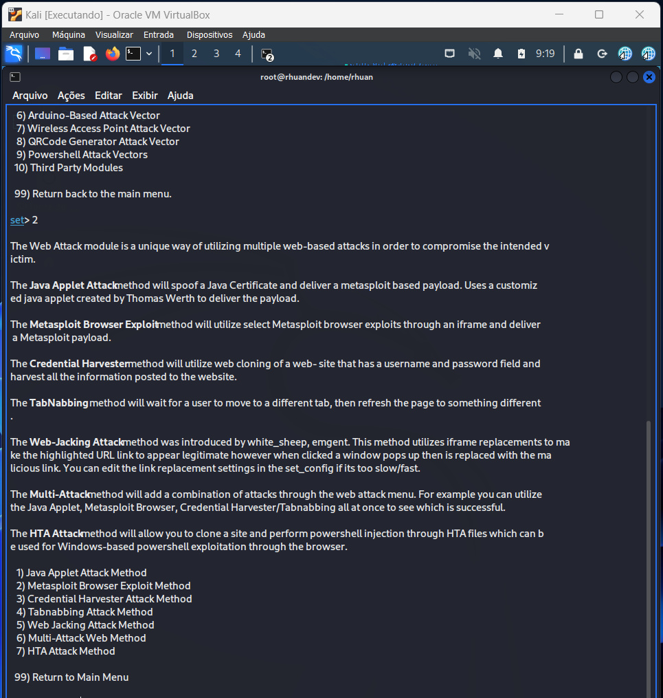
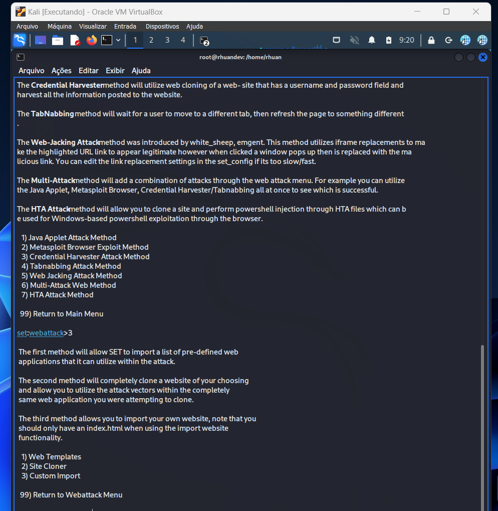
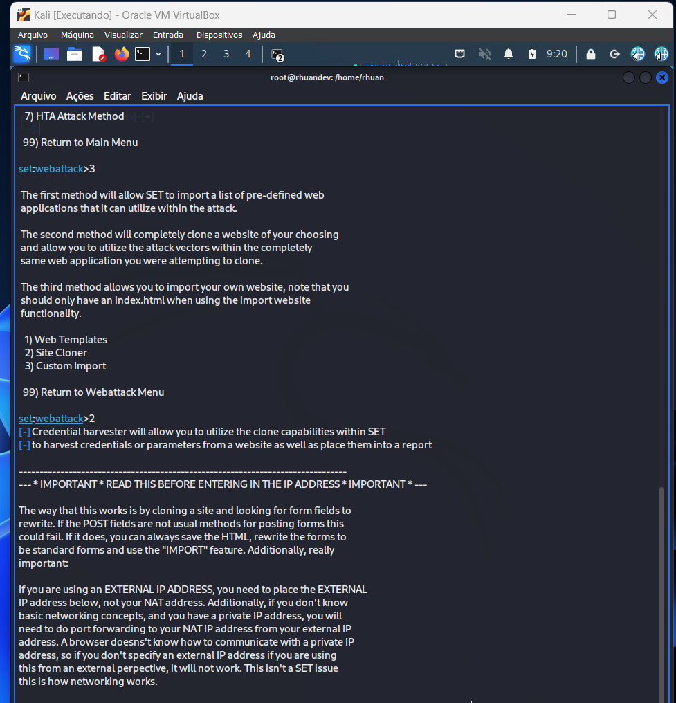
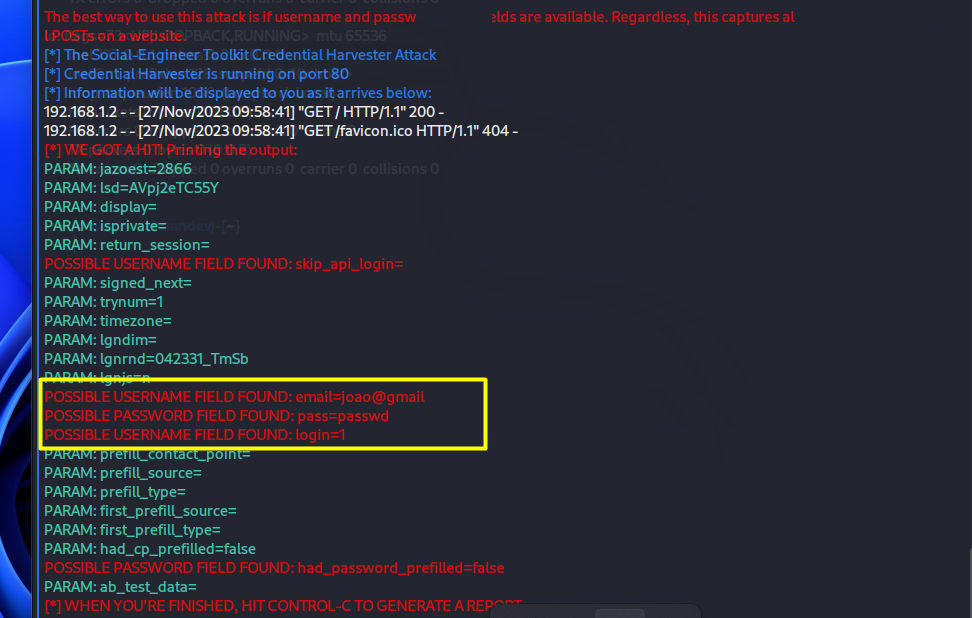

# Phishing para captura de senhas do Facebook

### Ferramentas

- Kali Linux
- setoolkit

### Configurando o Phishing no Kali Linux

- Acesso root: ``` sudo su ```
- Iniciando o setoolkit: ``` setoolkit ```<br>
  
- Tipo de ataque: ``` Social-Engineering Attacks ```<br>
  
- Vetor de ataque: ``` Web Site Attack Vectors ```<br>
  
- Método de ataque: ```Credential Harvester Attack Method ```<br>
  
- Método de ataque: ``` Site Cloner ```<br>
  
- Obtendo o endereço da máquina: ``` ifconfig ```
- URL clonada: http://www.facebook.com

### Resutados
.
